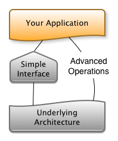
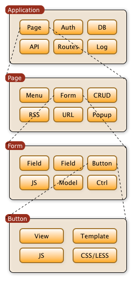

Design Goals
============

Agile Toolkit does not inherit patterns from other web frameworks.
Instead it takes a fresh look at Web Development and applies some
principles from desktop frameworks.

You'll find Agile Toolkit easier to learn if you understand its
fundamental principles first. Your knowledge of other web frameworks
might hold you back or prevent you from understanding Agile Toolkit.

The key principles to Agile Toolkit are:

-  Easy - Make things easier for developers
-  Advanced - Go advanced without refactoring
-  Compose - Build anything out of smaller components
-  Inherit - Use Object Oriented Programming extensively
-  Agile - Be Agile Methodology-friendly

Make Things Easy
----------------

Agile Toolkit attempts to abstract as much as possible of a web
development patterns into easy-to-use objects. One of the frequently
used objects is a :php:class:`Form`. Here is a simple form example::

    $form = $this->add('Form');

    $form->addField('Line', 'name')->validateNotNull();
    $form->addSubmit();

    if ($form->isSubmitted()) {
        $form->js()->univ()->alert('Hello, ',$form['name']);
    }

Some Comments: 

    univ() is not clear in this context for a beginner, as it does not
    explain itself. it would be easier to change it to ui() as an alert
    box is a resolut of rendering ui. 
    
    objects of form like name could be accessed by object attribute
    instead of array eg. 
    $form->js()->ui()->alert('Hello, ', $form->name );
    
    by having a smart __get() you could remove some brackets
    class Form {
        ...
        function __get( $name, $params ) {
            if ( !isset( $this->name ) && is_function( $this->name ) ) {
                return $this->$name(); 
            }
        }
        ...
    }
    
    then you can write
    $form->js->ui->alert('Hello, ', $form->name );
    
    adding fields and buttons is not consistent syntax, would be better to
    change the addField into add('Field', so its similar to add('Button')
    
    $form->add('Field','Line', ... );

Compared to the vanilla PHP approach to forms, this method gives
tons of advantages already:

- Great looking form with a proper outline
- Form uses AJAX to submit it's data, avoiding page refresh
- Data sanitization for input and output
- Form submission handling and field matching

.. tip::
    Agile Toolkit makes web development more simple than using
    NO frameworks at all. Any complex process is abstracted through a
    class into a manageable API.

**Agile Toolkit will always offer you a simple way to get things done.**

-  User Interface Creation - make a form/field/widget with one line
-  User Interface Theming - change look and feel easily
-  3rd party Add-ons - install in one click
-  Deploy to the cloud in few clicks (free hosting service)
-  Database access - perform database operation in one line
-  Routing - define pretty URL in one line
-  User Authentication - check user access with one line
-  Data Sources - switch between MySQL, Mongo, MemCache easily
-  Test Scripts - create test scripts with few lines of code
-  Relational SQL - use joins, expressions and sub-queries without
   headache
-  Performance - optimize your application for scalability
-  JavaScript - import 3rd party jQuery plugins with one line of code
-  AgileToolkit.org - get community help in one place
-  Commercial - priority support one click away

Go Advanced
-----------

   **Figure**: Many objects are simple, yet they can step away to reveal
   more of an underlying architecture for a more advanced needs.

Simplicity might get your application working in a record time, but just
as important is the ability to customize, tweak and provide long-term
support.

.. tip::  Agile Toolkit will never sacrifice access to advanced functionality,
    should you need it.

-  Create your own widgets - write your own HTML
-  Add your custom CSS rules on top of the theme
-  Use Composer to customize add-on installation
-  Deploy to a custom / your own server (commercial feature)
-  Execute complex queries and vendor-specific database code
-  Implement your own routing controller
-  Customize authentication mechanism or use 3rd party auth
-  Use your own SQL queries, access Mongo's collection object
-  Run automated tests from scripts
-  Write your own JavaScript library and use it anywhere

Build out of Blocks
-------------------

   **Figure**: Objects achieve functionality to heavily rely on other objects.

Composition means creating a new object out of other objects like
building blocks. Unlike giving you a one-fits-all solution, you'll have
a lot of smaller components and with knowledge will be able to build
unimaginable solutions yourself.

Compositions in User Interface
~~~~~~~~~~~~~~~~~~~~~~~~~~~~~~

The Toolkit uses this principle very strongly in user interface. Chunks
of user interface can be combined out of smaller components to build
more complex interfaces. Page consist of Views such as Form, CRUD or
Menu. Each of those Views can combine more Views recursively and/or rely
on HTML/JADE templates.

Composing Model Layer
~~~~~~~~~~~~~~~~~~~~~

Data management also use composition. Data is represented by :php:class:`Model` objects
yet fields are represented by :php:class:`Field` objects. Each can be extended
in their own way, for example :php:class:`SQL_Model` introduce relations and
join support while :php:class:`Field_Expression` introduces SQL expression
support.

You should build your data layer so that some models enhance
functionality of your other Models. By using Object Oriented principles
in ORM structure design, you can achieve elegancy::

    Model Admin_User extends User {
        function init() {
            parent::init();

            $this->addCondition('is_admin', true);
        }
    }

Composing Application
~~~~~~~~~~~~~~~~~~~~~

Application itself consist of blocks. For example - your application
will not have any authentication unless you add Auth controller. There
are many other controllers to provide functionality you might expect
from a framework: routing, error reporting, caching.

We make sure that there is a wide selection of 3rd party components
which you can use and combine together. Unlike other software solutions,
add-ons give you many components and blocks you can re-use.

It is also important to note that ANY object may contain blocks even if
it's not designed for it. Knowing that you can attempt to insert Button
inside Field or Search field inside Menu with great success.

Object Oriented Programming
---------------------------

.. figure:: ./inherit-principle.png
   :alt: Inherit Principle

   A Simplified Object Inheritance tree for Agile Toolkit

Often neglected in Web but consistently present in Desktop Frameworks -
inheritance is strong with Agile Toolkit.

All the classes defined in Agile Toolkit are "open", methods are easy to
re-define and override. The method names and arguments are preserved
consistent throughout the releases giving your application required
level of stability and a huge benefit of extensibility.

The use of Object Oriented Pattern gives immense amount of utility for
every single object:

-  to have children, where each is assigned unique name;
-  to support hooks, dynamic methods and simplified exceptions;
-  to support object destruction, session access, debug and warning
   facility;
-  AbstractView introduces "rendering" and templates;
-  AbstractView introduces JS event binding.

Most of 3rd party code developed for Agile Toolkit will inherit base
classes and will preserve all of the essential utility without no
overheads. Yet this allows you as a developer not only use add-on as a
whole, but use its models, views and other classes anywhere in your
code.

Agile Methodology
-----------------

If you are fond of Agile Methodology for software development, you'll
find that Agile Toolkit meets your coding style perfectly. There are
several patterns enforced by a framework itself which makes your
developers even more efficient:

-  Make your prototype quick, then tweak;
-  Separate Templates from Presentation Code and Business Code;
-  Minimum impact of refactoring - know exactly what areas are affected;
-  Generic Views - interface without bugs;
-  Working in teams - code consistently and safe;
-  Developers make mistakes - anticipate and prevent.

Agile Toolkit on testing
~~~~~~~~~~~~~~~~~~~~~~~~

-  Modular testing - add your widgets on a separate test-pages for
   rendering/UI regression testing
-  Integrated Visual testing environment designed to reduce time
   necessary to write test scripts and make them more useful
-  Performance and memory impact testing
-  Visual and Scripted tests

.. meta::
    :title lang=en: Design Goals of Agile Toolkit Framework
    :keywords lang=en: mvc, design, goals
