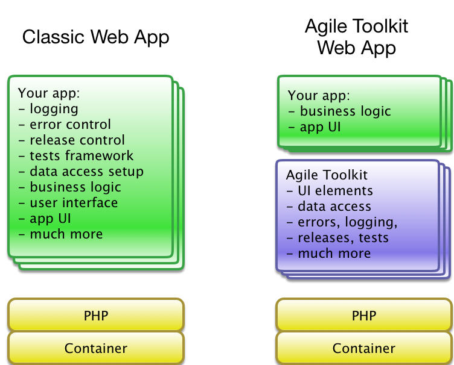

.. Agile Toolkit Book documentation master file

Welcome
#######

Agile Toolkit delivers a easy and worry-free way to build, deploy and scale
web applications. If you are new to web development, Agile Toolkit is the
easiest way to get your web app on-line.

Before you start comparing Agile Toolkit to other PHP frameworks, you need
to understand that there are 3 major parts to the whole Agile Toolkit
experience:

+-----------------------------------------+-------------------------------------------------+------------------------------------------------------------------+
| Sandbox                                 | Agile Toolkit Framework                         | Agile Cloud                                                      |
+=========================================+=================================================+==================================================================+
| Installed on your local computer, helps | Provides foundation for your                    | Deploy your Web App into a secure environment on our Web Server. |
| you during development of your web app. | web application and Web User interface          | Assign any domain. Use as production environment.                |
| Downloadable from agiletoolkit.org      | Included when downloading from agiletoolkit.org |                                                                  |
+-----------------------------------------+-------------------------------------------------+------------------------------------------------------------------+
| Similar to XCode + Instruments          | Similar to PHP frameworks + CSS Frameworks      | Similar to GitHub Pages, but runs on PHP and Docker              |
|                                         | + Object Oriented User Interface                |                                                                  |
+-----------------------------------------+-------------------------------------------------+------------------------------------------------------------------+
| Free for OpenSource Apps,               | Free for any use, Licensed under MIT.           | Limited use for free users.                                      |
| Professional subscription required      | Professional subscription required for          | Professional subscription can host up to 5 apps.                 |
| for commercial apps.                    | support and some add-ons.                       |                                                                  |
+-----------------------------------------+-------------------------------------------------+------------------------------------------------------------------+

The remainder of this book will focus on documenting Agile Toolkit Framework component. To learn more about
Sandbox and Agile Cloud, go to http://agiletoolkit.org/ and click Learn More.

What is included in Agile Toolkit Framework
===========================================

Agile Toolkit as a foundation of your application offers you much more value
than any other typical framework. It goes beyond PHP and also adds Agile CSS,
jQuery integration, HTML templates and PHP Object-Oriented layer for you.

Similarly to development in Windows, Mac or Mobile platforms you work with
UI objects that are ready to be used out-of-the box. Additionally the framework
integrates other components with the cloud infrastructure, to simplify
your experience.

Our goal is to let you focus on the most important bits of your application
while we cover technical and implementation details of your app.

We invite you on an exciting journey you develop your next Web App with
the least amount of code possible.

Getting Started
===============

Agile Toolkit development focuses on 3 steps in your application building:

#. Business Logic Layer - defining models, data sources and describing processes.
#. UI Layer - creating fancy UI to interface with Business Layer.
#. Enhancing - enhancing standard UI with your own.

Agile Toolkit attempts to simplify each step. To demonstrate with an example, we will build
a very simple a Web User Interface for entering and managing a List of Books in a library.

1. Create a Model
------------

Create a file shared/lib/Model/Book.php::

    class Model_Book extends Model {

        public $table='book';

        function init() {

            parent::init();
            $this->setSource('Session');

            $this->addField('title');
            $this->addField('year');
            $this->addField('author');

            $this->addField('is_borrowed')->type('boolean');
        }
    }

.. tip:: A Model in Agile Toolkit is always represented by a PHP class. We use
    PHP method calls to describe model structure, it's relationship and where
    the data is physically located (PHP Session in our example).

2. Build Web User Interface
------------------------

Because user will interract with your web application through the browser,
he needs User Interface. The UI Framework in Agile Toolkit is implemented
using a varietty of "View" objects.

One of the views is called "Page" and represents a URL user can navigate to.
Another View is a CRUD (Record Manager UI allowing to create update or delete
records).

To allow user to interract, you just need to add "CRUD" into a "Page". Open file
admin/page/index.php and add::

    class page_index extends Page {
        function init() {
            parent::init();

            $crud = $this->add('CRUD');
            $crud->setModel('Book');
        }
    }

Navigate to admin/public/ and you should see your ``CRUD`` in action.

.. todo::
    Add a sceenshot here

Explanation
-----------

You will be back through the process of creating models and UI over and over
again for all the new data types you will want to add to your web application.

The UI component of your application interacts with Data Source through Model:

.. figure:: figures/user-to-data-storage.png

Your web application can have many different pages and each page may place
one or several "Views" and connect each of them with Models. Knowing only
this much you can already create a full admin backend for your app.

Enhancing
=========

Now that you have got the basic editing, we will lightly look into Enhancing
process. You need to know that there many different types of enhancing you
can perform, here are few:

- Improve Workflow
- Improve UI look and feel
- Build your own theme
- Enhance of Business Logic

We will try to improve Workflow by adding ability to "borrow" the book easily.
Open your model file and add a new method inside your model::

    function borrow() {
        $this['is_borrowed']=true;
        $this->save();
    }

Next we need to update UI to reflect. Lets do that by adding more code after
the crud is initialized::

    if ($p = $crud->addFrame('borrow')) {

        $m = $crud->model;
        $m->load($crud->id);;

        if ($m['is_borrowed']) {
            $p->add('View_Error')->set('Book '.$m['title'].' is already borrowed');
        } else {

            $p->add('P')->set('Are you sure you want to borrow '.$m['title'].'?');

            $button = $p->add('Button')->set('Yes')->addClass('atk-swatch-green');
            if ($button -> isClicked()) {

                $m->borrow();
                $p->js()->univ()->closeDialog()->execute();

            }

            $p->add('Button')->set('No')->js('click')->univ()->closeDialog();
        }
    }

If the code seems a bit overwhelming for you, do not worry. We will go
through all the concepts here gradually in this documentation. Do, however,
try it out in the local copy of Agile Toolkit.

.. TODO::

    TODO: insert video / demo

The Coding Style of Agile Toolkit
=================================

When you are writing an application based on Agile Toolkit, you must follow
a coding style of Agile Toolkit. If you will try to incorporate Agile
Toolkit into your existing code structure you might face some difficulties.

For the best experience start a new application and improve it as you
read through this documentation.

Agile Toolkit is a unique development environment which you can start using
with a very basic knowledge. It is however quite important to come back to this
book if you are willing to unlock more potential inside your app.

.. meta::
    :title lang=en: .. Agile Toolkit Documentation
    :keywords lang=en: doc models,documentation master,presentation layer,documentation project,quickstart,original source,sphinx,liking,cookbook,validity,conventions,validation,accuracy,storage and retrieval,heart,blog,project hope
