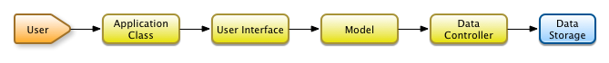

.. Agile Toolkit Book documentation master file

Welcome
#######

Agile Toolkit contains everything you need to develop web apps. It is a
self-sufficient PHP framework modeled after Desktop UI Toolkits. Agile
Toolkit may have some similar concepts to other Web MVC frameworks, but
most of the concepts are approaches are re-considered and improved.

Getting Started
===============

Agile Toolkit PHP framework can be divided into 3 major parts:

#. Data Layer - working with the database, APIs, etc.
#. UI Layer - creating fancy UI interfaces and outputing HTML.
#. Extensions - a lots and lots of ways to improve things.

Agile Toolkit goal is to make steps #1 and #2 as simple and straigtforward
for you, so you will be spending most of the time improving your
working application. To demonstrate with an example, we will build
a very simple a Web User Interface for entering and managing a List of Books.

Create a Model
------------

Create a file shared/lib/Model/Book.php::

    class Model_Book extends Model {

        public $table='book';

        function init() {

            parent::init();
            $this->setSource('Session');

            $this->addField('title');
            $this->addField('year');
            $this->addField('author');

            $this->addField('is_borrowed')->type('boolean');
        }
    }

.. tip:: A Model in Agile Toolkit is always represented by a PHP class. We use
    PHP method calls to describe model structure, it's relationship and where
    the data is physically located (PHP Session in our example).

Build Web User Interface
------------------------

Because user will interract with your web application through the browser,
he needs User Interface. The UI Framework in Agile Toolkit is implemented
using a varietty of "View" objects.

One of the views is called "Page" and represents a URL user can navigate to.
Another View is a CRUD (Record Manager UI allowing to create update or delete
records).

To allow user to interract, you just need to add "CRUD" into "Page". Open file
admin/page/index.php and add::

    class page_index extends Page {
        function init() {
            parent::init();

            $crud = $this->add('CRUD');
            $crud->setModel('Book');
        }
    }

Navigate to admin/public/ and you should see your ``CRUD`` in action.

.. todo::
    Add a sceenshot here

Explanation
-----------

You will be back through the process of creating models and UI over and over
again for all the new data types you will want to add to your web application.

   User Accessing Data

Your web application can have many different pages and each page may place
one or several "Views" and connect each of them with Models. Knowing only
this much you can already create a full admin backend for your app.

Extending
=========

Now that you have got the basic editing, you can pimp-it-up a little.

Open your model file and add a new method inside your model::

    function borrow() {
        $this['is_borrowed']=true;
        $this->save();
    }

Next we need to update UI to reflect. Lets do that by adding more code after
the crud is initialized::

    if ($p = $crud->addFrame('borrow')) {

        $m = $crud->model;
        $m->load($crud->id);;

        if ($m['is_borrowed']) {
            $p->add('View_Error')->set('Book '.$m['title'].' is already borrowed');
        } else {

            $p->add('P')->set('Are you sure you want to borrow '.$m['title'].'?');

            $button = $p->add('Button')->set('Yes')->addClass('atk-swatch-green');
            if ($button -> isClicked()) {

                $m->borrow();
                $p->js()->univ()->closeDialog()->execute();

            }

            $p->add('Button')->set('No')->js('click')->univ()->closeDialog();
        }
    }

If the code seems a bit overwhelming for you, do not worry. We will go
through all the concepts here gradually in this documentation. Do, however,
try it out in the local copy of Agile Toolkit.

.. TODO::

    TODO: insert video / demo

The Coding Style of Agile Toolkit
=================================

When you are writing an application based on Agile Toolkit, you must follow
a coding style of Agile Toolkit. If you will try to incorporate Agile
Toolkit into your existing code structure you might face some difficulties.

For the best experience start a new application and improve it as you
read through this documentation.

.. meta::
    :title lang=en: .. Agile Toolkit Documentation
    :keywords lang=en: doc models,documentation master,presentation layer,documentation project,quickstart,original source,sphinx,liking,cookbook,validity,conventions,validation,accuracy,storage and retrieval,heart,blog,project hope
